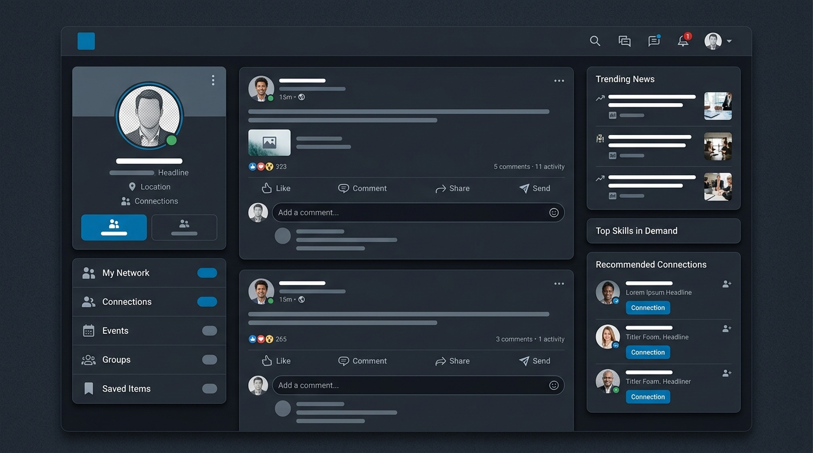

# LinkedIn UI Clone

An interactive professional networking application with a real-time mock backend, jobs portal, and chatbot messaging.

🔗🔗 <b><a href="https://kalaiarasane.github.io/LinkedIn---clone/">EXPERIENCE IT LIVE</a></b>

> ⚠️ **Educational UI clone for learning purposes only — not affiliated with LinkedIn / Microsoft.** Placeholder images and invented usernames only.

---

## ✨ The showpieces
- **Jobs Portal & Multi-Step Wizard**: Split-screen job search with filters, resume drag-and-drop uploader, and progress states.
- **Conversations & Auto-Chatbot**: Selection threads with chat bubbles, scroll anchors, and an automated response system featuring typing indicators.
- **Dynamic Feed CRUD**: Real-time post publishing, file attachments, and dynamic comments/likes engagement counters.
- **Live Image Customizations**: Immediate avatar and banner image swappers using client-side `FileReader` APIs.

## 🧱🧱 Sections
Home Feed · My Network Hub · Jobs Portal · Messages Pane · Activity Notifications · Detailed Profile View

## 🛠🛠 Stack
HTML5 · CSS3 · Vanilla JS interactions (Antigravity AI / Gemini 3.5 Flash where AI helped) · GitHub Pages

## 🎨🎨 Inspired by
- [LinkedIn Web](https://www.linkedin.com) visual components.
- Clean professional SaaS grids and dark mode styles on [Refero](https://refero.design).

## 🤖🤖 AI usage · 📚📚 What I learned

### AI Usage
- **Antigravity AI (Gemini 3.5 Flash)** was utilized to design components, structure CSS variables for the dual-theme toggles, and generate product mockup screenshots.

### What I Learned
- **Mock Bot Responses**: Learned how to implement a timeout-based async chatbot in JavaScript, complete with visual loading states (typing dots) to simulate network delay.
- **Multi-Step Form Wizards**: Engineered state-tracking logic for job application forms, handling transitions, uploader validation, and success feedback seamlessly.
- **Local Image Swapping**: Learned to read user-uploaded image files using the browser's `FileReader` API to dynamically replace profile banners and avatars locally.

---

## 🎓🎓 About TAP Academy

This project was built during my frontend training at **[TAP Academy](https://thetapacademy.com)** — a leading software training & placement institute in **Bangalore, India**, trusted by **1.5+ lakh students**.

**Why students choose TAP Academy:**
- 🚀🚀 **Get placed in 60 days** — dedicated placement track with daily placement drives
- 🥽🥽 **Augmented Reality (AR) classrooms** — concepts you can see, not just read
- 🎤🎤 **Weekly mock interviews** with real-time feedback
- 👨👨🏫🏫 **1-on-1 mentorship** and round-the-clock doubt support
- 💻💻 Courses in **Java, Python, Full Stack Development, Data Science & AI**

### ❓ FAQ

**What is TAP Academy?**
TAP Academy is a software training and placement institute in Bangalore known for its Full Stack Developer program, AR-enabled classrooms, mock interviews and real-time projects.

**Does TAP Academy provide placement support?**
Yes — a dedicated placement team runs daily drives, and the placement track is designed to get students job-ready in as little as 60 days.

**Where can I learn more?**
🔗🔗 [Website](https://thetapacademy.com) · [Placements](https://thetapacademy.com/placements) · [LinkedIn](https://in.linkedin.com/company/thetapacademy) · [YouTube](https://www.youtube.com/tapacademy)

---
*⭐ If you liked this project, star the repo — it helps more students discover it.*
